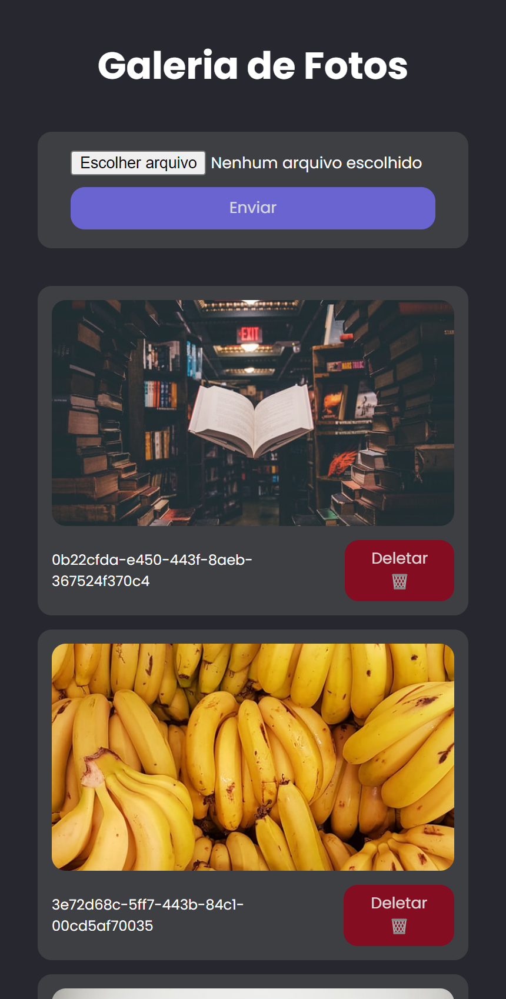

# Photo Gallery

## Project Description

This is a photo gallery project that allows users to upload images, view a list of all uploaded photos, and delete photos. The application uses Google's Firebase to centralize and manage the information.

## Features

- Photo Upload: Allows users to upload images to the gallery.
- Photo Listing: Displays a list of all uploaded photos.
- Photo Deletion: Allows users to delete specific photos from the gallery.

## Technologies

- React
- CSS Modules
- Firebase: Google's application development platform used to store and manage photos.
- uuid: Library used to generate unique names for uploaded photos.

## Project Structure

### Main Components

- App: The main component that manages the state and renders the upload, photo list, and deletion components.
- Loading: Loading component displayed while fetching photos.
- PhotoItem: Component representing an individual photo in the gallery.

### Services

- photos.ts: Service responsible for communicating with Firebase to perform CRUD (Create, Read, Update, Delete) operations on photos.

## Screenshots

### Gallery

### Gallery mobile

